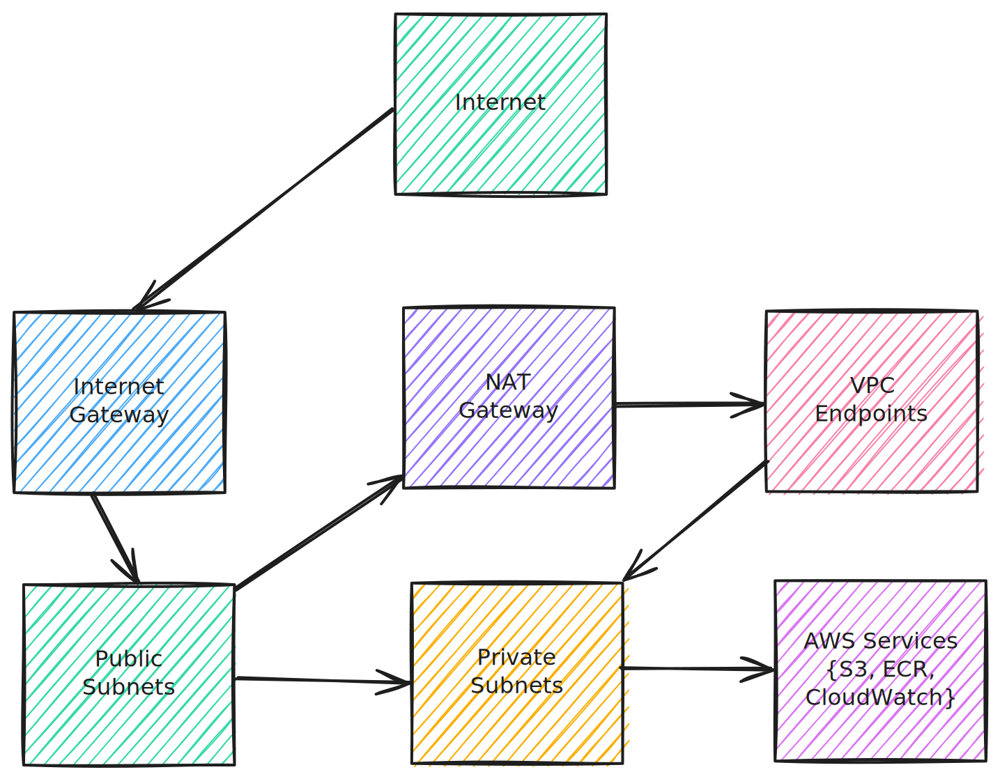

# AWS VPC Infrastructure as Code with Terraform

This project provides a robust and secure AWS VPC infrastructure setup using Terraform. It creates a production-ready VPC with public and private subnets, NAT Gateway, and VPC endpoints for AWS services, enabling secure and cost-effective network architecture.

The infrastructure implements AWS best practices for network segmentation and security. It creates a multi-AZ VPC with both public and private subnets, complete with internet connectivity through an Internet Gateway for public subnets and NAT Gateway for private subnets. The setup includes VPC endpoints for S3, ECR, and CloudWatch Logs, optimizing costs by keeping traffic within the AWS network. The infrastructure is fully automated and configurable through Terraform, making it easy to deploy and maintain consistent network environments.

## Repository Structure
```
wk1/04/vpc/config/
├── iam.tf           # IAM roles and policies for NAT Gateway
├── network.tf       # Core VPC infrastructure including subnets, route tables, and endpoints
├── outputs.tf       # Output definitions for VPC resources
├── provider.tf      # AWS provider configuration
└── variable.tf      # Input variables for VPC configuration
```

## Usage Instructions
### Prerequisites
- Terraform >= 1.0
- AWS CLI installed and configured
- AWS account with appropriate permissions
- AWS profile named "tf-user" configured

### Installation

1. Clone the repository:
```bash
git clone <repository-url>
cd wk1/04/vpc/config
```

2. Initialize Terraform:
```bash
terraform init
```

3. Review the configuration:
```bash
terraform plan
```

4. Apply the configuration:
```bash
terraform apply
```

### Quick Start

1. Configure your VPC CIDR and project name in `variable.tf`:
```hcl
variable "vpc_cidr" {
  default = "10.0.0.0/16"
}

variable "project_name" {
  default = "your-project-name"
}
```

2. Deploy the infrastructure:
```bash
terraform apply -auto-approve
```

### More Detailed Examples

1. Customizing Availability Zones:
```hcl
variable "availability_zones" {
  default = ["us-east-1a", "us-east-1b", "us-east-1c"]
}
```

2. Modifying environment settings:
```hcl
terraform apply -var="environment=prod" -var="project_name=prod-vpc"
```

### Troubleshooting

Common Issues:

1. VPC Endpoint Creation Failure
- Problem: VPC endpoints fail to create
- Error: "InvalidVpcEndpointType: Gateway endpoint cannot be created in subnet"
- Solution: Ensure route table associations are correct and security groups allow HTTPS (443)

2. NAT Gateway Issues
- Problem: Private subnets cannot access internet
- Debug: Check NAT Gateway status and route table configurations
- Solution: Verify EIP allocation and NAT Gateway placement in public subnet

Debug Mode:
```bash
export TF_LOG=DEBUG
terraform apply
```

Log files location: 
- Linux/MacOS: `$HOME/.terraform.d/log/`
- Windows: `%APPDATA%/terraform.d/log/`

## Data Flow

The VPC infrastructure implements a hub-and-spoke network topology where traffic flows through controlled pathways between public and private subnets. Internet-bound traffic from private subnets is routed through NAT Gateway while AWS service access is optimized through VPC endpoints.




Component Interactions:
1. Public subnets route internet traffic through Internet Gateway
2. Private subnets route internet traffic through NAT Gateway
3. VPC endpoints provide direct access to AWS services
4. Security groups control traffic flow between components
5. Route tables define network paths for each subnet
6. NAT Gateway enables outbound internet access for private resources
7. Private DNS resolution enabled for VPC endpoints


AWS Resources:
- VPC:
  - Main VPC with DNS support and hostnames enabled
  - CIDR: 10.0.0.0/16

- Subnets:
  - Public subnets in 3 AZs with auto-assign public IP
  - Private subnets in 3 AZs
  - Subnet CIDR blocks calculated dynamically

- Gateways:
  - Internet Gateway for public internet access
  - NAT Gateway for private subnet internet access

- VPC Endpoints:
  - S3 Gateway Endpoint
  - ECR Docker Interface Endpoint
  - ECR API Interface Endpoint
  - CloudWatch Logs Interface Endpoint

- Security:
  - IAM role for NAT Gateway
  - Security group for VPC endpoints
  - HTTPS (443) ingress rule for endpoint access

- Routing:
  - Public route table with internet gateway route
  - Private route tables for each AZ
  - Route table associations for all subnets